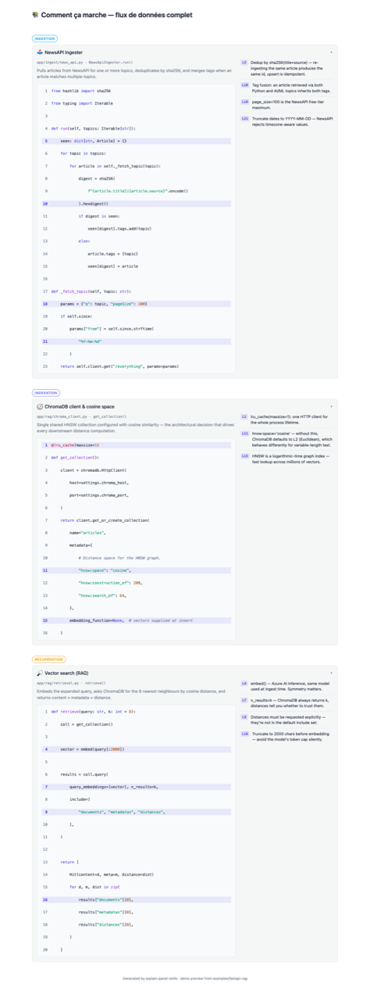

# ExplainPanel Skills

> Two Claude Code skills that turn any codebase into a beautiful, accordion-based "How it works" documentation panel — with syntax-highlighted code snippets, per-line annotations, and color-coded pipeline stages.

> Package: `explain-panel-skills` · Repo: [`sofiane-git/explain-panel-skills`](https://github.com/sofiane-git/explain-panel-skills)

[](LICENSE)
[](schemas/pipeline-map.schema.json)

## What it does

`explain-panel-skills` ships two skills that work together:

1. **`/explore-pipeline`** — walks your codebase, identifies the data flow, and produces a structured `docs/pipeline-map.json` documenting groups → sections → code snippets.
2. **`/explain-panel`** — reads the map, audits it against the live code, and generates a fully working `ExplainPanel.tsx` (React/Next.js), `ExplainPanel.vue` (Vue/Nuxt), or `docs/ExplainPanel.html` (auto-fallback when no frontend is detected — details in [Demo](#demo) and [Supported targets](#supported-targets)).

The generated output is an accordion sidebar with:
- syntax-highlighted code snippets (15–35 lines each)
- per-line annotations explaining the **why** behind the code
- color-coded pipeline stages (groups)
- full ARIA support and keyboard navigation (Tab / Enter / Escape)
- Tailwind or plain CSS variants (React/Vue); inline CSS with custom-property theming (HTML standalone)

## Why two skills?

Splitting exploration from generation has three benefits:

- **Cleaner context** — exploration reads a lot of files; component generation works from a compact JSON. Keeping them separate keeps each prompt focused.
- **Review-friendly** — `pipeline-map.json` is a small artefact you can hand-edit, version-control, and review before the component is generated.
- **Reusable** — the map can feed other documentation tools (READMEs, architecture diagrams, IDE plugins) — not just the panel.

## Installation

### Recommended — Claude Code marketplace (no clone)

Inside any Claude Code session:

```text
/plugin marketplace add sofiane-git/explain-panel-skills
/plugin install docpanel@explain-panel-skills
/reload-plugins
```

Both skills are then available as:

```text
/docpanel:explore-pipeline
/docpanel:explain-panel
```

Plugin-distributed skills are namespaced (`<plugin>:<skill>`) to prevent collisions. The marketplace is named after the repo (`explain-panel-skills`) for discovery; the plugin itself uses the shorter `docpanel` namespace to keep invocations readable. You can also invoke skills by description ("explore the pipeline", "generate the explain panel") without typing the full namespaced name.

### Alternative — manual copy / symlink

For offline installs, forks, or active development on the skills themselves, copy the skill directories directly into `~/.claude/skills/`. Skills then appear without the namespace prefix (`/explore-pipeline`, `/explain-panel`).

Full instructions, troubleshooting, and contributor workflow: [docs/install.md](docs/install.md).

## Usage

```bash
# 1. From your project root — analyse the codebase
/explore-pipeline
# Answers a few questions about monorepo layout, primary framework,
# and header language (optional — if you skip, the header falls back to the
# schema default, currently French: "Comment ça marche — flux de données complet").
# Writes docs/pipeline-map.json.

# 2. Optionally hand-edit docs/pipeline-map.json to tighten titles, annotations, ordering.

# 3. Generate the component
/explain-panel
# Audits the map against the live code, asks you to confirm any drift,
# then writes components/ExplainPanel.tsx (or .vue) — or docs/ExplainPanel.html
# if no frontend framework is detected (auto-fallback for backend-only projects).
```

Then import the component into a page (React/Vue case):

```tsx
import ExplainPanel from "@/components/ExplainPanel";
export default function Page() {
  return <ExplainPanel />;
}
```

If no frontend is detected (FastAPI / Django / Rails / Go / Rust / library), step 3 writes `docs/ExplainPanel.html` instead — a single self-contained file. Open it directly via `file://`, serve it from your backend's static directory, or embed it into MkDocs/Docusaurus/Sphinx. No `import`, no `npm install`. See [Supported targets](#supported-targets) for the per-stack integration recipe.

### Generating the panel in another language (French, Spanish, etc.)

Every text string in the panel comes from `docs/pipeline-map.json` — the renderer never translates anything. Two paths depending on what you need:

**Single-language panel (most common)** — write the map in your language.

1. During `/explore-pipeline`, answer the "header language" question with your locale (the skill ships defaults for English, French, Spanish, German, Japanese — type anything else as free text).
2. Write `header.title`, every `section.title` / `summary`, every `group.label`, and all `annotations` values in that language. UTF-8 free-form — no escaping.
3. Run `/explain-panel`. The generated component embeds those strings literally — no extra config.

Example (French — see [`examples/fastapi-rag/docs/pipeline-map.json`](examples/fastapi-rag/docs/pipeline-map.json) for a real one):

```json
{
  "header": { "title": "Comment ça marche — flux de données complet", "icon": "📚" },
  "groups": [
    {
      "id": "ingestion",
      "label": "Ingestion",
      "color": "sky",
      "sections": [
        { "title": "Récupération des articles", "summary": "Appelle NewsAPI…", "annotations": { "5": "Clé API lue depuis l'env" } }
      ]
    }
  ]
}
```

**Multi-language panel (rare)** — see [`docs/customization.md#i18n-beyond-the-header`](docs/customization.md#i18n-beyond-the-header). Short version: generate one map per locale (`pipeline-map.fr.json`, `pipeline-map.en.json`), produce one component per locale, switch on your app's current locale.

## Walkthrough — what the skills ask you

A beginner-friendly guide to every question both skills pose, in the order they appear.

### `/explore-pipeline` — 5 to 7 questions

**1. Is this a monorepo?**

The skill looks for `package.json` workspaces, `pnpm-workspace.yaml`, `turbo.json`, `Cargo.toml [workspace]`, etc. If it detects one, it lists the roots it found and asks which to include. Answer with the numbers of the roots that contain your pipeline's code. For a standard single-package repo, the skill skips this step automatically.

**2. What is the primary framework / stack?**

Used to decide the output format: React TSX (Next.js / React + Vite), Vue SFC (Nuxt / Vue + Vite), or HTML standalone (everything else). If your project has both a backend and a frontend, pick the frontend framework — the panel will live there. If there is no frontend, say so and the skill will produce a self-contained `docs/ExplainPanel.html`.

**3. What are the pipeline groups (stages)?**

Groups are the top-level phases of your data flow — typically 2 to 5 of them. Examples: `ingestion / processing / API`, `auth / billing / webhooks`, `read / write / background`. The skill proposes a starting set based on what it found in the codebase; you can rename, reorder, or replace them entirely. Each group gets a color chip in the panel header and a colored divider in the accordion list.

**4. For each group: which files / modules belong here?**

For each group, the skill asks you to confirm (or override) the files it identified as representative of that stage. It then picks a 15–35 line snippet from each file — the most illustrative block, not necessarily the top of the file. You can redirect it to a different function or line range if the default choice isn't the right one.

**5. Per section: title, icon, and one-line summary**

For each file/snippet, the skill proposes a short title (e.g. "Recipes Nitro handler"), an emoji icon, and a one-sentence summary of what the snippet does. Accept the defaults or type your own. These strings go directly into the generated component — no post-processing.

**6. Annotations: which lines to call out?**

The skill identifies the lines inside each snippet that carry the most weight (a key invariant, an unusual pattern, a non-obvious constraint) and drafts annotation text for each. You can accept, edit, or skip any annotation. Annotations appear below the code block as colored line badges with explanatory text. Aim for 2–5 per section — more than that becomes noise.

**7. Header language**

The panel header (e.g. `"Comment ça marche — flux de données complet"` in French) and all user-visible text come from `docs/pipeline-map.json` — the renderer never translates anything. The skill asks which language to use for the header title. Answer `fr`, `en`, `es`, `de`, `ja`, or type any locale string freely. All other text (section titles, summaries, annotations) must be written in that language when you answer questions 3–6 above.

After all questions, the skill writes `docs/pipeline-map.json`. **Review and hand-edit this file before running `/explain-panel`** — it is plain JSON, easy to tweak, and version-controllable.

---

### `/explain-panel` — 2 confirmation passes, then done

**Pass 1 — drift audit**

The skill reads every `file` path in the map and cross-checks the snippet against the live code. If a file has moved, a function has been renamed, or the line range no longer exists, it reports the drift and asks you to confirm or update the map entry before continuing. This prevents the panel from shipping stale code.

**Pass 2 — missing-module sweep**

The skill scans for modules referenced in group summaries or annotations that don't appear as sections in the map. It lists any gaps and asks whether to add them or mark them as intentionally excluded.

**Then: output selection (no question needed)**

If the framework is React or Vue, the skill writes `components/ExplainPanel.tsx` (or `.vue`) plus, for the plain-CSS variant, a companion `components/ExplainPanel.css`. If no frontend framework was detected, it writes `docs/ExplainPanel.html` — a single self-contained file with no build step required.

No further questions after the two passes. The component is ready to import (or open directly for the HTML variant).

---

## Demo



The screenshot above is the HTML standalone variant rendered from [`examples/fastapi-rag/docs/pipeline-map.json`](examples/fastapi-rag/docs/pipeline-map.json) (header in French, three groups: *Ingestion*, *Indexation*, *Récupération*). The screenshot was taken after manually expanding each section; the live file opens with sections collapsed — click any summary (or press Enter/Space when focused) to expand.

Want to interact with it locally? The pre-rendered file is checked in — open it in any browser:

```bash
open docs/media/demo.html        # macOS
xdg-open docs/media/demo.html    # Linux
```

No build step, no `npm install` — it's the exact output `/explain-panel` produces for a backend-only project. Tab through the sections, press Enter/Space to toggle, Escape to close.

## Supported targets

| Framework | Output | Status |
|-----------|--------|--------|
| Next.js (App Router) | `components/ExplainPanel.tsx` | ✅ |
| Next.js (Pages Router) | `components/ExplainPanel.tsx` | ✅ |
| React + Vite | `components/ExplainPanel.tsx` | ✅ |
| Nuxt 3+ | `components/ExplainPanel.vue` | ✅ |
| Vue 3 + Vite | `components/ExplainPanel.vue` | ✅ |
| **No frontend detected** (FastAPI, Django, Rails, Go, Rust, CLI, library) | **`docs/ExplainPanel.html`** — single self-contained file, zero runtime deps, pre-highlighted | ✅ |
| Tailwind CSS | Inline classes | ✅ |
| Plain CSS | BEM + companion `.css` | ✅ |
| Other CSS frameworks (UnoCSS, CSS Modules) | Fallback to plain CSS | ✅ via `--mode=css` |
| Svelte / Solid / Angular | — | not yet, contributions welcome |

### The HTML standalone variant

When no frontend framework is detected, `/explain-panel` automatically generates `docs/ExplainPanel.html`: a single ~17 KB file containing inline CSS, native `<details>` accordions, and pre-highlighted code (no `highlight.js`, no CDN, no `npm install`). Open it directly via `file://`, serve it from FastAPI's `StaticFiles`, Django's `staticfiles`, Rails' `public/`, or paste it into MkDocs/Docusaurus/Sphinx as a raw HTML block. The visual matches the React/Vue variants (same accordion, same group colors, same line-annotation layout). Override with `--framework=react` or `--framework=vue` if you actually want a component file even though no frontend is detected.

## Supported source languages

For the **source code** being documented (not the generated component), the kit recognises and syntax-highlights: Python, TypeScript/TSX, JavaScript/JSX, Vue, Go, Rust, Ruby, PHP, Java, Kotlin, Swift, C#, SQL, Bash, YAML, JSON, HTML, CSS, Markdown.

Other languages are accepted via the `"other"` enum value with manual highlighting fallback.

## Monorepo support

`/explore-pipeline` detects monorepos automatically via `package.json` workspaces, `pnpm-workspace.yaml`, `lerna.json`, `turbo.json`, `nx.json`, `Cargo.toml [workspace]`, and `pyproject.toml`. It then **asks you** which roots to include — never assumes. See [docs/monorepo.md](docs/monorepo.md) for the full detection logic.

## Pipeline groups: you define them

The examples use groups like `routing / data / mutations` (Next.js) or `ingestion / indexation / retrieval / generation` (FastAPI RAG). **These are not built-in categories.** They're the project author's choice of how to slice their own code into stages.

The schema enforces only:

- **1–8 groups** per map (`groups[]`), ordered chronologically.
- **1–8 sections** per group (`groups[].sections[]`).
- A unique `id` and a `color` (preset name or custom hex object) per group.

Pick whatever group names match how *you* explain your project. `auth / billing / webhooks`, `read-path / write-path / background-jobs`, `parse / validate / store / serve` — all valid. `/explore-pipeline` proposes a starting set during the interview; you can override anything before the map is written.

See [`docs/pipeline-map-format.md`](docs/pipeline-map-format.md#groups) for the full field reference.

## Source framework ≠ output framework

The panel renderer (React TSX or Vue SFC) is **decoupled** from the language of the code being documented. The FastAPI example documents Python and outputs React because the original project shipped a React frontend — it could just as well output Vue. Pick the panel variant that matches the UI stack of the app where you'll embed it, not the backend language of the code you're documenting.

## Examples

Four reference projects with full `pipeline-map.json` + generated component. They cover the output matrix (React TSX / Vue SFC / HTML standalone) rather than the full list of supported source frameworks — `/explore-pipeline` reads any codebase, so Django / Express / Rails / Spring etc. work without a dedicated example.

- [`examples/fastapi-rag/`](examples/fastapi-rag/) — Python RAG pipeline (FastAPI + ChromaDB + Azure AI). Backend-only source, React output (the original project shipped a React frontend). Source for this kit's authoring story.
- [`examples/nextjs-app/`](examples/nextjs-app/) — Next.js full-stack app. Backend = Server Actions + Route Handlers (no separate service). React output.
- [`examples/nuxt-app/`](examples/nuxt-app/) — Nuxt 3 site. Backend = Nitro `server/api/*` handlers (no separate service). Vue SFC output + plain-CSS variant.
- [`examples/python-cli/`](examples/python-cli/) — backend-only Python CLI with **no frontend at all** (`framework: "other"`). Demonstrates the HTML standalone auto-fallback: the same `docs/ExplainPanel.html` you see embedded in the [Demo](#demo) above is the output here.

> **The examples are snapshots, not runnable repos.** Each `examples/*/` directory ships a complete `docs/pipeline-map.json` and the corresponding generated component (`components/ExplainPanel.tsx` / `.vue`) so reviewers can see input → output without running the skills themselves. The Python / TS / Vue source files referenced from the maps (`app/ingest/news_api.py`, `app/page.tsx`, `pages/index.vue`, etc.) **do not exist** in the example directories — those paths describe the original projects the examples were authored from. As a consequence, running `/explain-panel` from inside an example directory will fail the audit phase ("file not found"), and that is expected. The examples exist to document the format and the generated output, not to be re-run. For the same reason they are deliberately trimmed to 3–9 sections each — below the 8–13-module guidance `/explore-pipeline` applies to real projects — so reviewers can read input and output in one sitting.

## Documentation

| Doc | Content |
|-----|---------|
| [`docs/architecture.md`](docs/architecture.md) | Why two skills, what they share, how the JSON is the contract |
| [`docs/pipeline-map-format.md`](docs/pipeline-map-format.md) | Full reference for every field in `pipeline-map.json` |
| [`docs/customization.md`](docs/customization.md) | Colors (preset + custom), header text, CSS overrides, extending the schema |
| [`docs/monorepo.md`](docs/monorepo.md) | How `roots[]` works, how detection runs, when to override |
| [`docs/migration.md`](docs/migration.md) | Upgrading between schema versions |
| [`docs/install.md`](docs/install.md) | Install paths (marketplace, manual copy, symlink), troubleshooting, and marketplace publishing notes |
| [`docs/releasing.md`](docs/releasing.md) | Versioning policy (kit version vs `schemaVersion`), release checklist, release-notes conventions |

## Schema

`pipeline-map.json` conforms to [`schemas/pipeline-map.schema.json`](schemas/pipeline-map.schema.json) (JSON Schema 2020-12). The schema is the source of truth — both skills validate against it.

Add this line at the top of your `pipeline-map.json` to get IDE autocomplete and inline validation:

```json
{
  "$schema": "https://raw.githubusercontent.com/sofiane-git/explain-panel-skills/main/schemas/pipeline-map.schema.json",
  "schemaVersion": "1.0",
  ...
}
```

The URL points at `main` on purpose, not a tagged release: the **`schemaVersion`** field is the real compatibility contract — the schema on `main` only ever adds optional fields or relaxes constraints within a major version, and breaking changes bump the major + ship a migrator under [`migrate/`](migrate/). If you prefer a frozen URL, pin to a tag: `…/v1.1.0/schemas/pipeline-map.schema.json`.

## Contributing

PRs welcome. Please read [CONTRIBUTING.md](CONTRIBUTING.md) before opening one. Key conventions:

- Skill files live in `skills/<name>/SKILL.md`.
- Templates live in `skills/explain-panel/references/`.
- Schema changes bump `schemaVersion` and ship a migration in `migrate/`.

## License

MIT — see [LICENSE](LICENSE).
